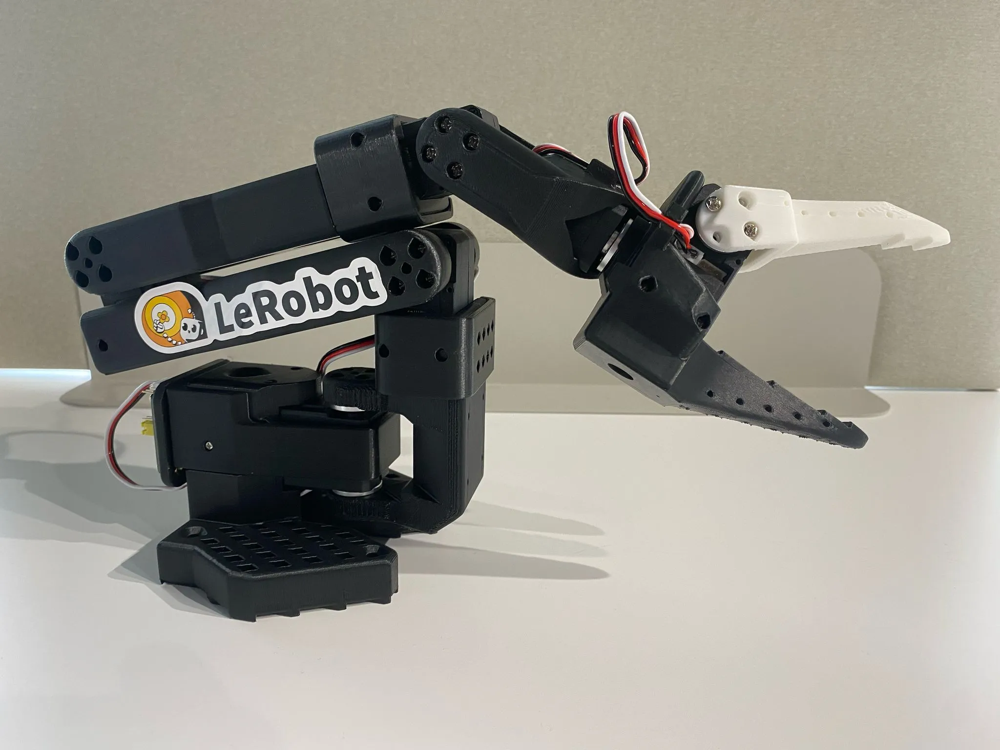
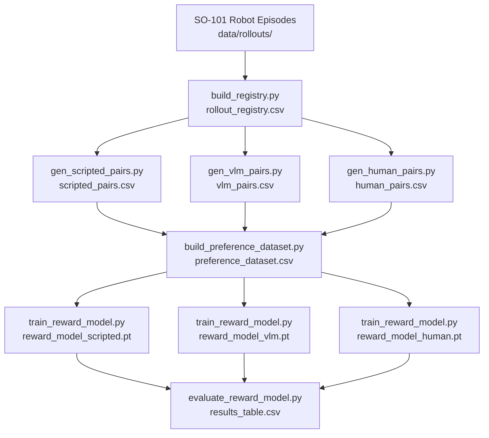

# Preference Feedback for Robot Manipulation


<p align="center">
  
</p>

This project compares three sources of preference feedback (scripted rules,
human labels, and vision-language model scoring) to train and evaluate reward
models for robot pick-and-place tasks on a real SO-101 arm. The goal is to
determine which feedback source produces the safest, most reliable, and most
cost-effective reward signal.

## Quick Start

```bash
git clone https://github.com/Reinforcement-Learning-RLHF/vlm-pref
cd vlm-pref
pip install -r requirements.txt
cp .env.example .env        # add your GOOGLE_API_KEY
python scripts/download_lerobot_dataset.py --max-episodes 5
python scripts/build_registry.py
python scripts/gen_scripted_pairs.py
```

## Team Split

| Team | Responsibility |
|---|---|
| **Robotics** | Record episodes with the SO-101 arm via LeRobot; deliver mp4 + `metadata.json` per episode into `data/rollouts/` |
| **ML (this repo)** | Preference labeling, reward model training, and comparison |

## Pipeline



See [docs/pipeline.md](docs/pipeline.md) for a full step-by-step description.

## Milestone Progress

| Milestone | Status | Due |
|---|---|---|
| 1: Basic rollout generation | Done | May 24 |
| 2: Unified evaluation infrastructure | In progress | June 29 |
| 3: Preference dataset generation | In progress | July 14 |
| 4: Preference model trains successfully | In progress | July 20 |
| 5: Experimental comparison complete | Not started | Aug 3 |
| 6: End-to-end integrated pipeline | Not started | Aug 10 |

## Setup

```bash
python -m venv ~/robenv
source ~/robenv/bin/activate      # Windows: ~/robenv/Scripts/activate
pip install -r requirements.txt
```

## Data Setup

Raw rollout videos are not committed to the repo. To regenerate them:

```bash
# Download 50 real SO-101 episodes from HuggingFace
python scripts/download_lerobot_dataset.py

# Or generate mock episodes for testing
python scripts/generate_mock_rollouts.py
```

Copy `.env.example` to `.env` and fill in your keys:

```bash
cp .env.example .env
# then edit .env and add your GOOGLE_API_KEY
```

## Running the Pipeline

**Step 1: Build the rollout registry** (re-run after every new episode batch):

```bash
python scripts/build_registry.py
```

**Step 2: Generate preference pairs** (run one or all three):

```bash
# Scripted: instant, no API or GPU needed
python scripts/gen_scripted_pairs.py

# Human: interactive terminal session (opens videos on request)
python scripts/gen_human_pairs.py --sample-size 50

# VLM: Gemini (recommended, requires GOOGLE_API_KEY in .env)
python scripts/gen_vlm_pairs.py

# VLM: local HuggingFace model (backup, requires GPU, no API cost)
python scripts/gen_vlm_pairs.py --backend hf --model Qwen/Qwen3-VL-2B-Instruct
```

All scripts write to `data/preferences/` and accept `--help` for full options.

**Step 3: Merge all preference sources into one dataset:**

```bash
python scripts/build_preference_dataset.py
```

**Step 4: Train reward models** *(not yet implemented)*:

```bash
python scripts/train_reward_model.py --evaluator scripted
python scripts/train_reward_model.py --evaluator vlm_gemini
python scripts/train_reward_model.py --evaluator human
```

**Step 5: Compare results** *(not yet implemented)*:

```bash
python scripts/evaluate_reward_model.py
```

## Utility Scripts

```bash
# Convert HDF5 image arrays to mp4 (for pre-LeRobot data)
python scripts/convert_hdf5_to_mp4.py <hdf5_path> --output output.mp4

# Extract keyframes from a video using optical flow
python scripts/extract_keyframes.py --video_path path/to/video.mp4
```

## Project Structure

```
data/rollouts/          Raw episodes (mp4 + metadata.json per subfolder)
data/preferences/       Generated preference CSVs (one per labeling source)
prompts/                VLM system prompts (Gemini and HuggingFace variants)
src/data/               Registry building logic
src/preferences/        Preference labeling modules (scripted, human, vlm)
src/reward_model/       Reward model training and evaluation (TODO)
scripts/                Runnable CLI entry points
results/                Reward curves and final comparison table
docs/                   Format specs and pipeline documentation
archive/                Superseded scripts and experimental code
```

## Data Sources

| Source | Episodes | Task | Format |
|---|---|---|---|
| lerobot/svla_so101_pickplace | 50 | Pick and place | Real SO-101 arm |
| Custom pour simulation | 6 | Pouring | Simulated |
| SO-101 team recordings | TBD | Pick and place | Real SO-101 arm |

Download real SO-101 episodes:

```bash
python scripts/download_lerobot_dataset.py
```

## Data Format

See [docs/rollout_format.md](docs/rollout_format.md) for the full episode format spec, required `metadata.json` fields, and registry CSV schema.
